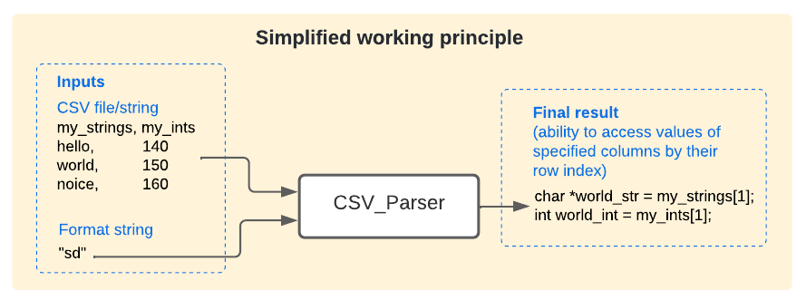
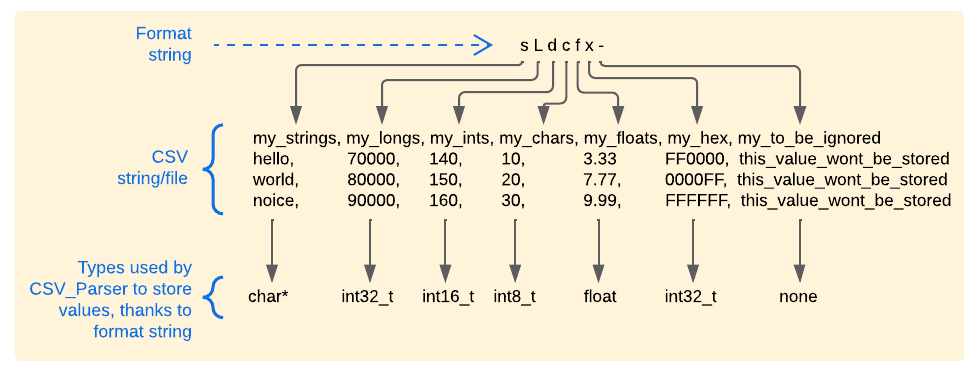

## Table of contents
* [What is CSV format](#what-is-csv-format)  
* [What is this CSV parser](#what-is-this-csv-parser)  
* [Installation](#installation)  
* [Usage](#usage)  
* [Examples](#examples)  
* [Things to consider](#things-to-consider)  
* [Specifying value types](#specifying-value-types)  
	* [How to store unsigned types](#how-to-store-unsigned-types)  
* [Casting returned values](#casting-returned-values)  
* [Headerless files](#headerless-files)  
* [Custom delimiter](#custom-delimiter)  
* [Custom quote character](#custom-quote-character)  
* [Checking if the file was parsed correctly](#checking-if-the-file-was-parsed-correctly)  
* [Troubleshooting](#troubleshooting)  
* [Motivation](#motivation)  
* [Documentation](#documentation)  


## What is CSV format
CSV means comma separated values. It's like a normal "txt" file with commas at regular places to separate some values.  
Typically the first line of CSV file is a "header", containing names of columns (this way any reader knows which column means what).  
Example CSV file with header and 2 columns:  

> Date,Temperature  
> 2020/06/12,20  
> 2020/06/13,22  
> 2020/06/14,21  

Using CSV format is one way of organising data, which makes it easy for programs to read.  


## What is this CSV parser
It's a class to which you can supply:  
- csv string (including new-line characters)  
- [format string](#specifying-value-types) (where each letter specifies type of value for each column)  

Class parses that string, in other words, it extracts values, stores them and provides you with:  
- easily accessible set of arrays (their types are specified by the format string)  

It adheres to the [RFC 4180 specification](https://tools.ietf.org/html/rfc4180).  
It was written with care to not be greedy in terms of occupied memory and parsing time.  

  


## Installation
In Arduino IDE select **Tools->Manage libraries**, type "csv" in the top editbox, find "CSV Parser" and press **install**.  

    

Then just add the following line at the top of your sketch:  
```cpp
#include <CSV_Parser.h>
```


## Usage
```cpp
char * csv_str = "my_strings,my_longs,my_ints,my_chars,my_floats,my_hex,my_to_be_ignored\n"
		 "hello,70000,140,10,3.33,FF0000,this_value_wont_be_stored\n"
		 "world,80000,150,20,7.77,0000FF,this_value_wont_be_stored\n"
		 "noice,90000,160,30,9.99,FFFFFF,this_value_wont_be_stored\n";

CSV_Parser cp(csv_str, /*format*/ "sLdcfx-");

char    **strings =         (char**)cp["my_strings"];
int32_t *longs =          (int32_t*)cp["my_longs"];
int16_t *ints =           (int16_t*)cp["my_ints"];
char    *chars =             (char*)cp["my_chars"];
float   *floats =           (float*)cp["my_floats"];
int32_t *longs_from_hex = (int32_t*)cp["my_hex"];    // CSV_Parser stores hex as longs (casting to int* would point to wrong address when ints[ind] is used)

for (int i = 0; i < cp.getRowsCount(); i++) {
    Serial.print(strings[i]);             Serial.print(" - ");
    Serial.print(longs[i], DEC);          Serial.print(" - ");
    Serial.print(ints[i], DEC);           Serial.print(" - ");
    Serial.print(chars[i], DEC);          Serial.print(" - ");
    Serial.print(floats[i]);              Serial.print(" - ");
    Serial.print(longs_from_hex[i], HEX); Serial.println();
}
```

Output:  
> hello - 70000 - 140 - 10 - 3.33 - FF0000  
> world - 80000 - 150 - 20 - 7.77 - FF  
> noice - 90000 - 160 - 20 - 9.99 - FFFFFF   

Notice how each character within `"sLdcfx-"` string specifies different type for each column. It is very important to set this format right. 
We could set each solumn to be strings like "sssssss", however this would use more memory than it's really needed. If we wanted to store a large array of small numerical values (e.g. under 128), then using "c" specifier would be appropriate. See [Specifying value types](#specifying-value-types) section for full list of available specifiers and their descriptions.  

  

**Is it necessary to supply the whole string at once?**   
No, it may be supplied in incomplete parts as shown in [this example](https://github.com/michalmonday/CSV-Parser-for-Arduino/blob/master/examples/supplying_csv_by_incomplete_parts/supplying_csv_by_incomplete_parts.ino).   
```cpp
/*   "sL" means "string" (char* type) and "Long" (int32_t type)  */
  CSV_Parser cp(/*format*/ "sL");

  /*CSV file:
    my_strings,my_numbers\n
    hello,5\n
    world,10\n
  */

  /* File supplied in chunks: */
  cp << "my_st" << "rings" << ",my_n";
  cp << "umbers\nh" << "ello,5\nwor" << "ld,10\n";
                
  char **strings = (char**)cp["my_strings"];
  int32_t *numbers = (int32_t*)cp["my_numbers"];
  
  for(int row = 0; row < cp.getRowsCount(); row++) {
    Serial.print(row, DEC);
    Serial.print(". String = ");
    Serial.println(strings[row]);
    Serial.print(row, DEC);
    Serial.print(". Number = ");
    Serial.println(numbers[row], DEC);
  }
```

We may as well supply the csv file character by character like:  
```cpp
char * csv_str = "my_strings,my_floats\n"
		 "hello,1.1\n"
		 "world,2.2\n";
		 
CSV_Parser cp(/*format*/ "sf"); // s = string, f = float

for (char c : String(csv_str)) {
   cp << c;
}

/* or (to avoid using "String" object)
for (int i = 0; i < strlen(csv_str); i++) {
   cp << csv_str[i];
} */
```

Since version 1.0.0, we can supply various types:  
```cpp
// original csv file = "101,102,103\n"
// how we could supply it:
cp << '1' << 0 << "1";
cp << ",";
cp << String(102) + ",103\n";
```
Floats can be supplied as well. In general, any types can be supplied, the principle is: if the type isn't "String", "char \*" or "char", then the String(supplied_value) will be appended (before being parsed and stored as a type specified in the format string).   

**Important**  
Arduino built-in File.read() method returns an integer (instead of a char). Therefore, it's important to cast its return before supplying it to CSV_Parser object, like:  
```cpp
File csv_file = SD.open(f_name); // or FFat.open(f_name);
while (csv_file.available()) {
    cp << (char)csv_file.read();
}
```
Without `(char)`, the string representation of ascii number would be stored.  
Before the 1.0.0 version, the `cp << 97;` expression would append letter 'a' (because '97' stands for 'a' in ascii table). From 1.0.0 version onwards, the `cp << 97;` is equivalent to `cp << String(97);`, it will append '97' instead of 'a'. That is correct behaviour in my opinion, however due to design of Arduino built-in "File.read()" method, which returns an integer, it is necessary to cast it's return (with `(char)csv_file.read()` as shown above), and problems may occur if some existing code (using this library) doesn't explicitly cast it.  


## Examples
Examples directory contains examples showing:  
* [basic usage](https://github.com/michalmonday/CSV-Parser-for-Arduino/tree/master/examples/basic_usage)  
* [how to handle unsigned types](https://github.com/michalmonday/CSV-Parser-for-Arduino/tree/master/examples/unsigned_values)   
* [how to supply csv by incomplete parts](https://github.com/michalmonday/CSV-Parser-for-Arduino/tree/master/examples/supplying_csv_by_incomplete_parts)   
* [how to read csv file from a PC (using provided python script)](https://github.com/michalmonday/CSV-Parser-for-Arduino/tree/master/examples/reading_from_computer_python)  
* [how to read csv file from SD card](https://github.com/michalmonday/CSV-Parser-for-Arduino/tree/master/examples/reading_from_sd_card)   


## Things to consider  
If CSV file doesn't contain header line, then it must be specified as 3rd argument of the constructor (see [this example](#headerless-files))  
If CSV file is separated by other character instead of comma, then it must be specified as 4th argument of the constructor (see [this example](#custom-delimiter))  

Programmer must:  
* know and specify what type of values are stored in each of the CSV columns (see [this example](#specifying-value-types))  
* cast returned values appropriately (see [this example](#casting-returned-values))  

The CSV file may:  
* include mixed type of line endings ('\r\n', '\n')  
* end with '\n' or '\r\n' but it doesn't have to  
* have empty fields  

  
**Important - if the file does not end with "\n" (new line) then cp.parseLeftover() method must be called after supplying the whole file (regardless if it was supplied all at once or in parts). Example:**      
```cpp
char * csv_str = "my_strings,my_floats\n"
		 "hello,1.1\n"
		 "world,2.2"; // last line is not ending with "\n" or "\r\n"
		 
CSV_Parser cp(csv_str, /*format*/ "sf"); // s = string, f = float
cp.parseLeftover();
```


**What if the string itself stored in CSV contains comma (or other custom delimiter)?**  
As described in the [RFC 4180 specification](https://tools.ietf.org/html/rfc4180) we can enclose the string using double quotes. Example csv:   
> my_strings,my_ints\n  
> "single, string, including, commas",10\n  
> "another string, with single comma",20  


**What if we wanted to store double quotes themselves?**   
As described in the [RFC 4180 specification](https://tools.ietf.org/html/rfc4180) we can put two double quotes next to each other. The parser will treat them as one. Example:   
> my_strings,my_ints\n   
> "this string will have 1 "" double quote inside it",10\n  
> "another string with "" double quote char",10\n  

Parser will read such file as:  
1st string = this string will have 1 " double quote inside it  
2nd string = another string with " double quote char  

Notice that it's possible to customize the quote char as shown in [this section](#custom-quote-character). E.g. to use single quotes (') instead.  

**Header fields leading and trailing spaces are ignored**  
Example:  
```cpp
char * csv_str = "  test a  ,  test b  \n" // header names include leading and trailing spaces
                 "1,2\n"
                 "3,4\n";
	 
CSV_Parser cp(csv_str, "cc");
int8_t *a = (int8_t*)cp["test a"]; // notice how "test a" is used instead of "  test a  "
int8_t *b = (int8_t*)cp["test b"];
```
		  
## Specifying value types 
```cpp
char * csv_str = "my_strings,my_floats\n"
		 "hello,1.1\n"
		 "world,2.2\n";
		 
CSV_Parser cp(csv_str, /*format*/ "sf"); // s = string, f = float
```

Example above is specifying "s" (string) for the 1st column, and "f" (float) for the 2nd column.   

Possible specifiers are:   
| Specifier | Type | Description |
| --- | --- | --- |
| **s** | string (char\*) |  C-like string, not a "String" Arduino object. |
| **f** | float |  
| **L** | int32_t | 32-bit signed value, value range: -2,147,483,648 to 2,147,483,647. Capital L is used because lowercase "l" looks like number one "1". |
| **d** | int16_t | 16-bit signed value, value range: -32,768 to 32,767. |
| **c** | char |    8-bit signed value, value range: -128 to 127. |
| **x** | int32_t | Expects hexadecimal string (will store "10" or "0x10" csv as 16). |
| **-** |  | Dash character means that value is unused/not-parsed, this way memory won't be allocated for values from that column. |
| **uL** | uint32_t | 32-bit unsigned value, value range: 0 to 4,294,967,295. |
| **ud** | uint16_t | 16-bit unsigned value, value range: 0 to 65,535. | 
| **uc** | uint8_t |  8-bit unsigned value, value range: 0 to 255. |
| **ux** | uint32_t | Expects hexadecimal string (will store "10" or "0x10" csv as 16). |

#### How to store unsigned types
As shown in the table above, unsigned type specifiers are made by preceding the integer based specifiers ("L", "d", "c", "x") with "u". 

Example:  
```cpp
char * csv_str = "column_1,column_2\n"
     "201,202\n"
     "203,204\n";

CSV_Parser cp(csv_str, /*format*/ "ucuc");
``` 

See [unsigned_values example](https://github.com/michalmonday/CSV-Parser-for-Arduino/blob/master/examples/unsigned_values/unsigned_values.ino) for more info.  

## Casting returned values
Let's suppose that we parse the following:  
```cpp
char * csv_str = "my_strings,my_floats\n"
		 "hello,1.1\n"
		 "world,2.2\n";
		 
CSV_Parser cp(csv_str, /*format*/ "sf"); // s = string, f = float
```

To cast/retrieve the values we can use:  
```cpp
char  **strings = (char**)cp["my_strings"];
float *floats =   (float*)cp["my_floats"];
```

"x" (hex input values), should be cast as "int32_t*" (or uint32_t*), because that's how they're stored. Casting them to "int*" could result in wrong address being computed when using `ints[index]`.  
  
  
## Headerless files
To parse CSV files without header we can specify 3rd optional argument to the constructor. Example:  
```cpp
CSV_Parser cp(csv_str, /*format*/ "---L", /*has_header*/ false);
```

And then we can use the following to get the extracted values:  
```cpp
int32_t * longs = (int32_t*)cp[3]; // 3 becuase L is at index 3 of "---L" format string
```


## Custom delimiter
Delimiter is 4th parameter of the constructor. It's comma (,) by default. We can customize it like this:  
```cpp
char * csv_str = "my_strings;my_floats\n"
		 "hello;1.1\n"
		 "world;2.2\n";
		 
CSV_Parser cp(csv_str, /*format*/ "sf", /*has_header*/ true, /*delimiter*/ ';');
```  

## Custom quote character
Quote character is 5th parameter of the constructor. It's double quote (") by default. We can customize it like this:  
```cpp 
CSV_Parser cp(csv_str, /*format*/ "sLdcfxs", /*has_header*/ true, /*delimiter*/ ',', /*quote_char*/ "'");
```


## Checking if the file was parsed correctly
Use CSV_Parser.print function and check serial monitor. Example:  
```cpp
CSV_Parser cp(csv_str, /*format*/ "sLdcfx-");
cp.print();
```

It will display parsed header fields, their types and all the parsed values. Like this:  
> CSV_Parser content:  
>   Header:  
>      my_strings | my_longs | my_ints | my_chars | my_floats | my_hex | -  
>   Types:  
>      char* | int32_t | int16_t | char | float | hex (long) | -  
>   Values:  
>      hello | 70000 | 140 | 10 | 3.33 | FF0000 | -   
>      world | 80000 | 150 | 20 | 7.77 | FF | -  
>      noice | 90000 | 160 | 30 | 9.99 | FFFFFF | -  

**Important - cp.print() method is using "Serial" object, it assumes that "Serial.begin(baud_rate);" was previously called.**  

## Troubleshooting  

Platformio users reported compilation issues due to SD library import by the CSV_Parser.cpp file. Since 0.2.1 version of this library, the SD import can be disabled by placing `#define CSV_PARSER_DONT_IMPORT_SD` above (it won't work if it's below) the CSV_Parser library import like this:  

```cpp
#define CSV_PARSER_DONT_IMPORT_SD
#include <CSV_Parser.h>
```
  
## Motivation
I wanted to parse [covid-19 csv](https://github.com/tomwhite/covid-19-uk-data) data and couldn't find any csv parser for Arduino. So instead of rushing with a quick/dirty solution, I decided to write something that could be reused in the future (possibly by other people too).  


## Documentation 
https://michalmonday.github.io/CSV-Parser-for-Arduino/index.html  
